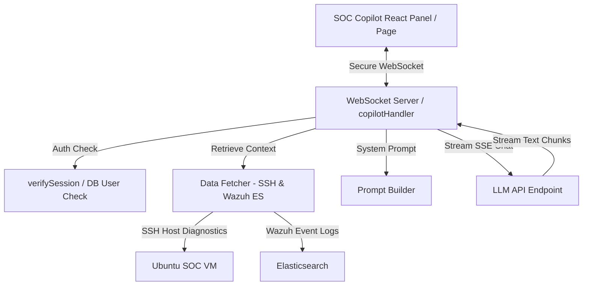

# NG-SENTRA SOC Copilot: Complete End-to-End Implementation Guide

This guide details the complete architecture, development steps, and technical explanations of the AI-powered SOC Copilot built for the **NG-SENTRA SOC Dashboard**.

---

## 🏗️ Architectural Overview

The SOC Copilot uses a hybrid architecture spanning backend real-time streaming, local diagnostics polling, secure role-based access control (RBAC), and a responsive modern frontend UI:

---

## 🛠️ Step-by-Step Implementation

### Step 1: Real-Time SSE Streaming Backend
**Location**: [llm.ts](file:///c:/Users/ZIAD/ng-sentra/server/_core/llm.ts)

*   **Implementation**: Developed `streamLLM()` to handle Server-Sent Events (SSE) from the LLM provider.
*   **Key Logic**:
    *   Reads the API response stream chunk-by-chunk using a `TextDecoder` and splits chunks on newline characters.
    *   Parses OpenAI/Gemini compatible SSE structures (`data: { choices: [{ delta: { content } }] }`).
    *   **Dynamic Provider Detection**: Programmed automatic key analysis (detecting standard Google Gemini `AIzaSy` keys and OpenAI `sk-` keys).
    *   If using Gemini, requests route to the Google AI Studio compatibility endpoint (`https://generativelanguage.googleapis.com/v1beta/openai/`) using `gemini-2.5-flash`.
    *   If using OpenAI, requests route to OpenAI's base endpoint with `gpt-4o-mini`.
    *   Omits platform-specific properties like `thinking` budget for direct non-platform API connections to avoid schema validation rejections.

---

### Step 2: Multi-Source Diagnostics Data Fetcher
**Location**: [data-fetcher.ts](file:///c:/Users/ZIAD/ng-sentra/server/copilot/data-fetcher.ts)

*   **Implementation**: Created a secure collector to fetch VM metrics in parallel without blocking server execution.
*   **Key Logic**:
    *   **Docker Container Statuses**: Runs `docker ps` via SSH to list active and stopped containers.
    *   **Critical Container Logs**: Collects tail logs from high-importance containers like the AI models, Snort, and Wazuh manager.
    *   **Systemd Services**: Polls systemctl state for active and failed core OS daemons.
    *   **Snort Alerts**: Reads active IDS alerts from Snort's alert file.
    *   **auditd Security Audit Logs**: Reads host logs through `ausearch` to flag unauthorized modifications.
    *   **Wazuh Alerts**: Queries Wazuh's Elasticsearch database directly for recent security alerts, automatically identifying critical severities (Level 10+).

---

### Step 3: Security-Context Prompt Builder
**Location**: [prompt-builder.ts](file:///c:/Users/ZIAD/ng-sentra/server/copilot/prompt-builder.ts)

*   **Implementation**: Assembles the LLM system instructions, feeding the parsed VM diagnostic snapshot directly into the AI's system context.
*   **Key Logic**:
    *   Injects VM host details: CPU architecture, running container count, stopped services, active alerts, UBA metrics, and Snort logs.
    *   Instructs the AI to act as a Staff SOC Platform Engineer and Incident Handler.
    *   Enforces structured threat-hunting suggestions, mitigation steps, and references to MITRE ATT&CK tactics (e.g., Privilege Escalation, Initial Access).

---

### Step 4: Persistent Thread Storage (Database Schema & Helpers)
**Locations**: 
*   [schema.ts](file:///c:/Users/ZIAD/ng-sentra/drizzle/schema.ts)
*   [db.ts](file:///c:/Users/ZIAD/ng-sentra/server/db.ts)
*   [routes.ts](file:///c:/Users/ZIAD/ng-sentra/server/routes.ts)

*   **Implementation**: Integrated persistent database storage so security analysts do not lose their threat-hunting threads.
*   **Key Logic**:
    *   **Drizzle Schema**: Created a `copilot_sessions` table mapping:
        *   `id`: unique session UUID.
        *   `userId`: foreign key mapping back to users.
        *   `title`: dynamically derived from the user's initial query.
        *   `messages`: JSON column storing message array history.
        *   `metadata`: snapshot references, IPs, and tags.
    *   **tRPC Endpoints**: Registered routes within `appRouter` to allow fetching, updating, listing, and deleting copilot sessions.

---

### Step 5: WebSocket Handler & RBAC Security Layer
**Location**: [copilotHandler.ts](file:///c:/Users/ZIAD/ng-sentra/server/copilot/copilotHandler.ts)

*   **Implementation**: Developed the WebSocket server that bridges the user's interface with the streaming diagnostics engine.
*   **Key Logic**:
    *   **Authentication & Session Verification**: Parses request cookies using `COOKIE_NAME` and decodes the JWT using `sdk.verifySession(token)`. Resolves the exact user profile from the database, falling back to local auth configuration when offline.
    *   **RBAC Protection**: Rejects WebSocket connections if the user's role is not `Admin` or `Analyst` (preventing read-only Viewers from accessing diagnostic shells or LLMs).
    *   **Rate Limiting**: Enforces a strict window-based limit (12 queries/minute per client IP) to block brute-force resource starvation.
    *   **Zod Schema Validation**: Sanitizes all socket events (`ping`, `message`, `cancel`) using Zod.
    *   **Audit Logging**: Every prompt is captured and logged into the `audit_logs` table with action tag `COPILOT_QUERY` for forensic auditing.

---

### Step 6: Frontend WebSocket State Management Hook
**Location**: [useCopilotSocket.ts](file:///c:/Users/ZIAD/ng-sentra/client/src/hooks/useCopilotSocket.ts)

*   **Implementation**: A custom React Hook to manage WebSocket lifecycle, state transitions, and text chunk assembly.
*   **Key Logic**:
    *   **Incremental Token Accumulation**: As delta chunks are received, appends them to the active streaming assistant message.
    *   **Heartbeat Pings**: Sends periodic `ping` messages every 30 seconds to keep the socket tunnel open and prevent browser timeouts.
    *   **Exponential Backoff Reconnection**: Retries connection up to 5 times using a `delay * 1.5` multiplier if network disruption occurs.
    *   **Response Aborting**: Handles stream cancellation by sending a `cancel` packet, signaling the backend to immediately terminate the LLM stream.

---

### Step 7: Premium Sliding Panel UI
**Location**: [SOCCopilotPanel.tsx](file:///c:/Users/ZIAD/ng-sentra/client/src/components/SOCCopilotPanel.tsx)

*   **Implementation**: The interactive panel that overlay-slides into view.
*   **Key Logic**:
    *   **Glassmorphism Theme**: Uses Tailwind CSS with custom backdrops, shadows, and gradients.
    *   **Keyboard Shortcut**: Listens globally for `Ctrl + K` to toggle the panel.
    *   **Diagnostic Source Badges**: Renders live telemetry indicators showing Wazuh and SSH connection status.
    *   **Telemetry Snapshot Card**: Shows summaries of scanned containers, service health, and alerts.
    *   **Pre-baked Security Prompts**: Organizes quick-click prompts divided into categories (Containers, Host Audits, Network IDS, Wazuh).

---

### Step 8: Dedicated Layout Mount & App Routing
**Locations**:
*   [SOCLayout.tsx](file:///c:/Users/ZIAD/ng-sentra/client/src/components/SOCLayout.tsx)
*   [CopilotPage.tsx](file:///c:/Users/ZIAD/ng-sentra/client/src/pages/CopilotPage.tsx)
*   [App.tsx](file:///c:/Users/ZIAD/ng-sentra/client/src/App.tsx)

*   **Implementation**: Integrated the Copilot globally into the layout navigation and registered the full-screen experience.
*   **Key Logic**:
    *   **Global Layout Mount**: Placed `<SOCCopilotPanel />` inside the main layout wrapper so the panel works persistently on all pages.
    *   **Navigation Sidebar**: Linked a dedicated Copilot nav icon to `/copilot`.
    *   **Dedicated Fullscreen Workspace**: Built `CopilotPage.tsx` using a split-pane layout to give security engineers a spacious environment for log analyses.
